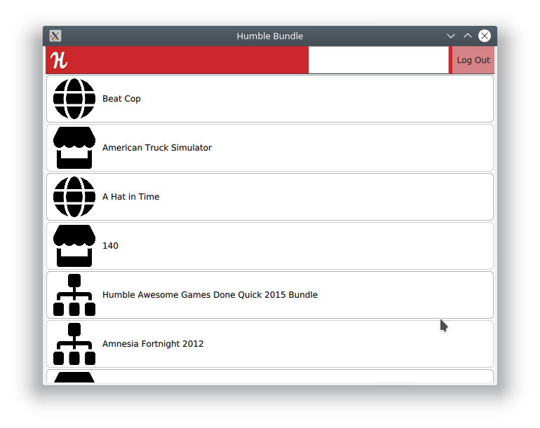
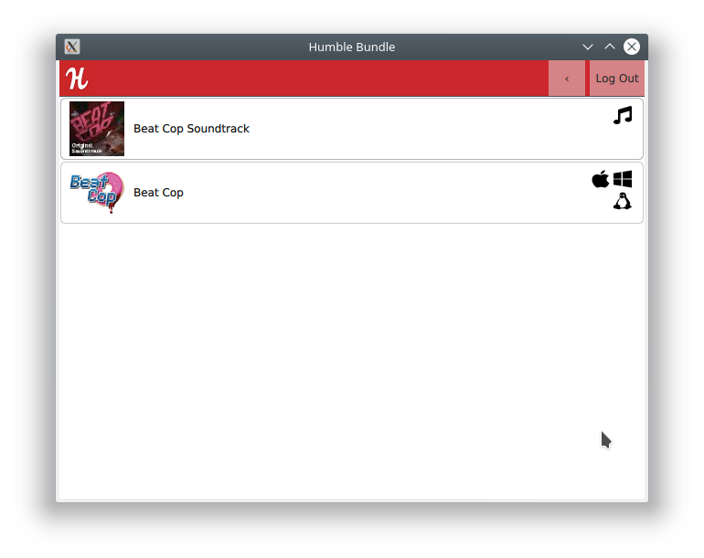
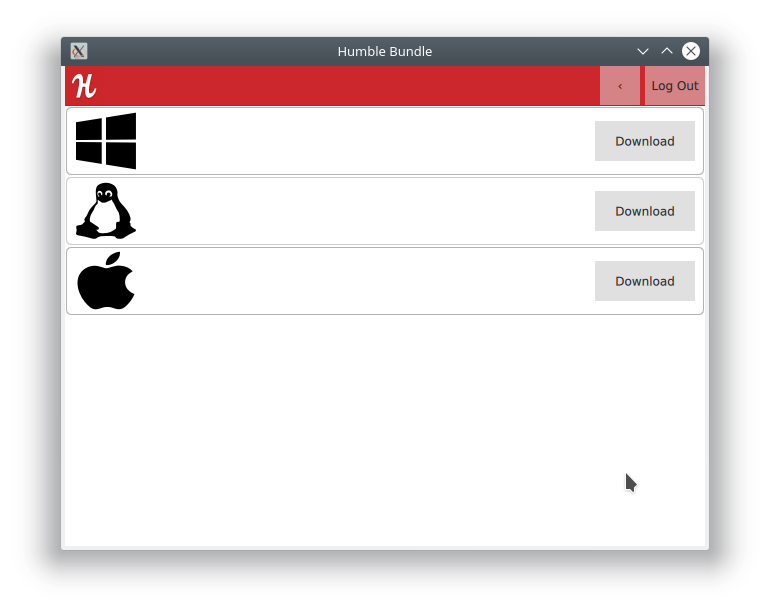

# QHumble

## Cross Platform Humble Bundle Client

### About

QHumble aims to be a software client for accessing downloadable content from Humble Bundle. Unlike the official Android client, this one shows you which purchases/bundles your content comes from and allows you to filter through them to find the content you are looking for. 

* Supports accounts that use a 2FA code system like Authy or Google Auth.
* Auto fetches purchase details when viewing purchases to keep up-to-date download URLs.
* Downloads/opens content with system default applications.







### Building

QHumble currently uses the QMake build system default to Qt Creator. Simply load the project in Qt Creator or run 
```qmake``` 
in the project directory and get a standard makefile. 
